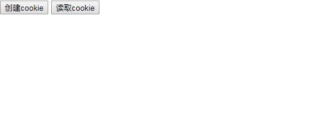

# 存取cookie和读取cookie

效果如下：
gfgfdgfd


demo code:
```javascript
<!DOCTYPE html>
<html>
<head lang="en">
    <meta charset="UTF-8">
    <title></title>

</head>
<body>
<input onclick="addcokie()" type="button"value="创建cookie"/>
<input onclick="readcokie()" type="button"value="读取cookie"/>
<h1 id="h11"></h1>
</body>
</html>
<script>
    function addcokie(){
        var exp=new Date();
        exp.setTime(exp.getTime()+7*24*60*60*1000);
        document.cookie="usename=yanbo;"+"expires="+exp.toGMTString();
    }
    function readcokie(){
        h11.innerHTML=document.cookie;
    }
</script>
```

